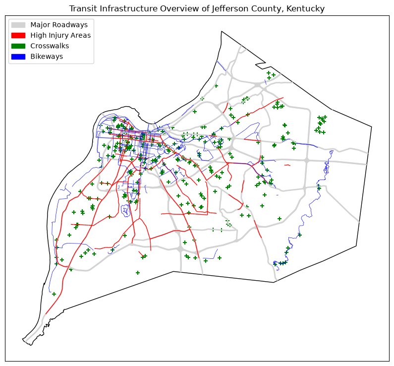

# Louisville Roadway Risk
Roadway Risk for Pedestrians and Cyclists in Louisville, KY (2018 - 2022)

## Project Overview
> A brief analysis of how the most dangerous roadways in Louisville intersect with bikeways and crosswalks. 



## Prerequisites
This project includes a Jupyter Notebook for analyzing the Louisville roadway safety data sets. Directions included here are for running the notebook in **Visual Studio Code** (available from https://code.visualstudio.com/download) or **VSCodium** (available from https://vscodium.com/). The notebook may also be opened in **Jupyter Notebook Interface** (available from https://docs.jupyter.org/en/latest/install.html), but this has not been tested.

## Project Structure
```
.
├── data
│   ├── Jefferson_County_KY_Bikeways.geojson
│   ├── Jefferson_County_KY_Midblock_Crossings.geojson
│   ├── Ky_County_Polygons
│   │   ├── Ky_County_Polygons_WM.cpg
│   │   ├── Ky_County_Polygons_WM.dbf
│   │   ├── Ky_County_Polygons_WM.prj
│   │   ├── Ky_County_Polygons_WM.shp
│   │   ├── Ky_County_Polygons_WM.shp.xml
│   │   └── Ky_County_Polygons_WM.shx
│   ├── Louisville_Metro_Area_KY_Major_Roads.geojson
│   ├── Louisville_Metro_Area_KY__TARC_Bus_Stops.geojson
│   ├── Louisville_Metro_KY_-_High_Injury_Network.geojson
│   ├── LouKY_transit_overview.png
│   ├── roadway_risk.db
│   └── Vision_Zer0_Louisville-High_Injury_Network_Methodology_Report.pdf
├── LICENSE
├── Louisville_Roadway_Risk_Analysis.ipynb
├── README.md
└── requirements.txt
```

## How to run this project
### 1. Clone this repository

```bash
git clone https://github.com/JishGorft/Roadway_Risk.git
```

### 2. Create a virtual environment

```bash
cd Roadway_Risk
python -m venv .venv
```

### 3. Activate the virtual environment
Activate the virtual environment (varies by operating system):

#### **Linux and macOS:**
```bash
source .venv/bin/activate
```

#### **Windows:**
```bash
.venv\Scripts\activate.bat
```
### 4. Install Dependencies
Once the virtual environment is activated, install the required packages:

```bash
pip install -r requirements.txt
```

### 5. Open the Jupyter Notebook
1. Open the cloned *Roadway_Risk* folder in **VSCodium**.
2. From the Explorer panel (left-hand side of the window), click the file `Louisville_Roadway_Risk_Analysis.ipynb` to open it.
3. Click **Select Kernel** in the upper-right corner of the notebook.
5. Select the Python virtual environment (venv) you created in Step 2. **VSCodium** will *likely* recommend this as the preferred environment.
6. Click **Run All** near the top of the notebook window.

> **Please note:** You may be prompted to install Python and/or Jupyter extensions by VSCodium, if you do not already have them installed. If so prompted, please install the extensions. In Visual Studio Code, the publisher will be Microsoft. In VSCodium, the publisher is *ms-toolsai* for Jupyter and *ms-python* for Python.

### Deactivation
Don't forget! When you are done running the project, you should deactivate the Python virtual environment from the terminal:

```bash
deactivate
```

## Python Libraries Used
- **pandas**, for creating and handling dataframes
- **geopandas**, for reading data sets in GeoJSON files
- **geopy**, for converting shape lengths calculated by default in *degrees* to *miles*
- **matplotlib**, for plotting visualizations, custom visualization labels, and to access to colormaps used in visualizations
- **shapely**, for geopandas geometry management assistance
- **sqlite3**, to aggregate and combine datasets dynamically

## Analytical Questions
- How much of Louisville's non-automotive transportation infrastructre falls within "high injury network" [as defined by Vision Zero Louisville](data/Vision_Zer0_Louisville-High_Injury_Network_Methodology_Report.pdf)? 
- Which infrastructure locations, including bikeways and crosswalks, are at highest risk of experiencing a vehicular crash?
- What safety measures are already in place? Can additional no- or low-cost measures (i.e. reducing speed limit) be implemented?

## Other Notes & Methodology
- All data files in the *data* directory were retrieved from from [Lousiville Open Data](https://data.louisvilleky.gov/).
- Standardization of geographic data: Translation of all distance units into miles, and ensuring all data sets use the same coordinate reference system (CRS).
- Exploratory data analysis (EDA) using Python (pandas, matplotlib, geopandas). 
- SQLite was used lightly in this project for some basic aggregation and calculation. An ERD for the SQLite database can be viewed [here](data/erd.png).

## Findings & Insights
- More granular analysis of downtown Louisville specifically is warranted. The most severe crashes seem to occur in downtown, and downtown contains several bikeways and many crosswalks.
- Two-thirds of crosswalks that fall in the high-injury network are near schools, and these zones average 160 accidents per year.
- Fortunately, only 9% of the city's bikeways, and 10% of total crosswalks, fall in the high-injury network of roadway corridors.

## Future Enhancements Possible
- Integrate [Metro KY Road Context Classifications](https://data.louisvilleky.gov/datasets/LOJIC::louisville-metro-ky-road-context-classifications) dataset for more granular analysis. 
- Create an interactive dashboard which could be used to generate information dialogs on mouseover.
- Further code cleanup: Some efficiencies can be gained in the visualizations by adding loops, particlarly for labeling.

## AI Usage
The author of this project prefers not to rely on so-called AI. As such, no generative AI tools, chatbots, or other LLM technology has been used in building this project.

## Author
Josh Groft

## License
GPLv3